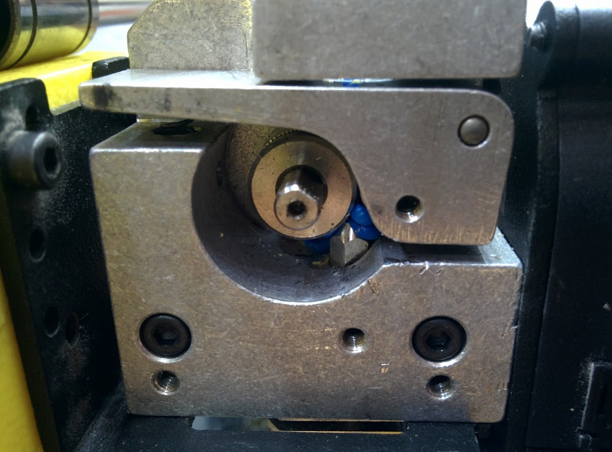
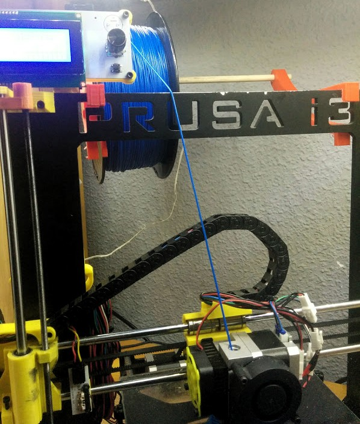

# Imprimiendo Filamento Flexible

Usando [FlexiSmart](http://www.fffworld.com/flexismart/) de fffworld
Tienen una excelente [guía](https://dl.dropboxusercontent.com/u/36943089/fffworld/ES_FlexiSMART_Guide.pdf)

Al ser flexible el filamento es más difícil de empujar y al primer problema se dobla. También ocurre lo mismo si intentamos empujarlo muy rápido

El principal problema viene que a veces el filamento no sigue el camino que debiera y se producen atranques

(Imagen tomado de la guía de FFFworld)

Y aquí un ejemplo real

Por todo esto hay que quitar la retracción e imprimir más despacio

Esta es la configuración que estoy usando (tomada a partir de la configuración de [filaflex para mi impresora Hephestos](http://recreus.com/en/filaflex-filaments/42black-filaflex-175mm.html))

Y este es el resultado

Un problema que me he encontrado es que al empezar una nueva impresión a veces el filamento no sale y hay que descargar y volver a cargarlo...

Alguna gente usa [tensores para el filamento](http://www.thingiverse.com/thing:779011).

En mi caso por la forma del portarollos no parece necesario

