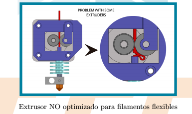
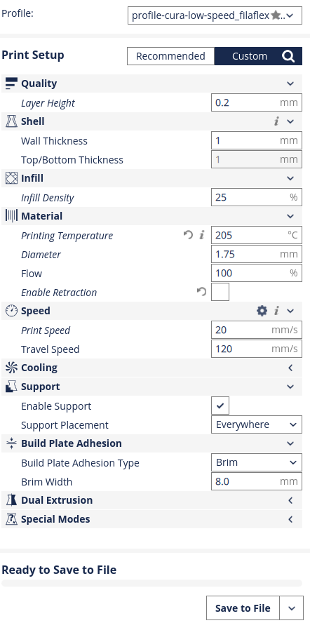
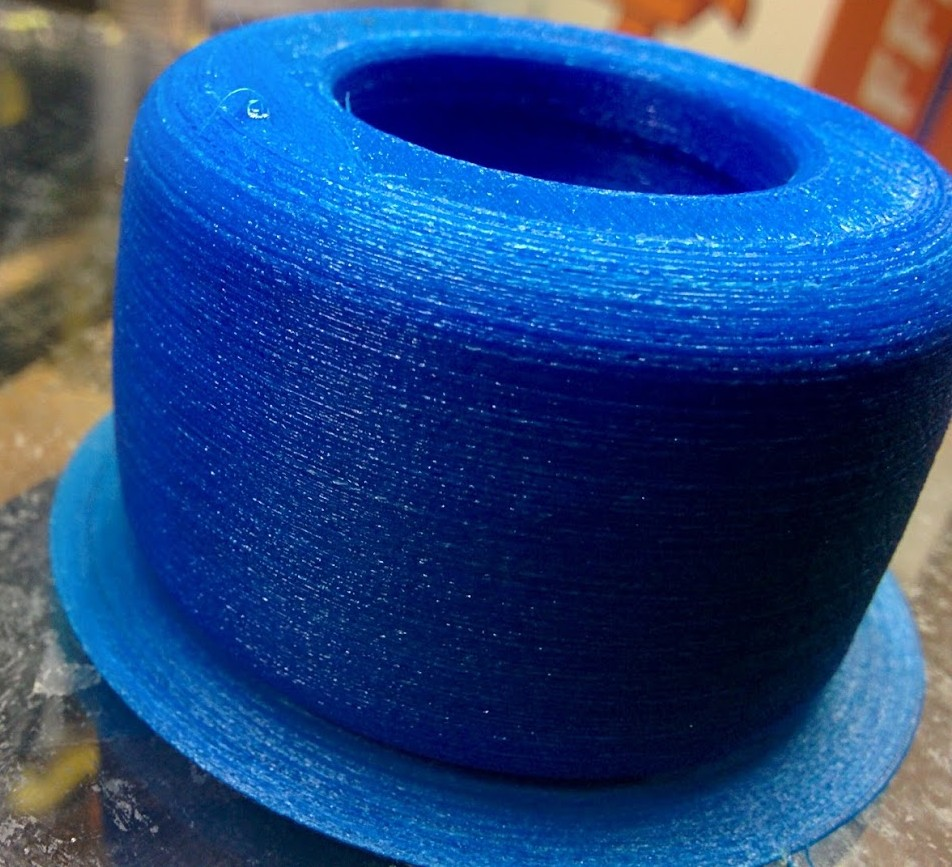

# Imprimiendo Filamento Flexible

Usando [FlexiSmart](http://www.fffworld.com/flexismart/) de fffworld
Tienen una excelente [guía](https://dl.dropboxusercontent.com/u/36943089/fffworld/ES_FlexiSMART_Guide.pdf)

Al ser flexible el filamento es más difícil de empujar y al primer problema se dobla. También ocurre lo mismo si intentamos empujarlo muy rápido

El principal problema viene que a veces el filamento no sigue el camino que debiera y se producen atranques

(Imagen tomado de la guía de FFFworld)

Por todo esto hay que quitar la retracción e imprimir más despacio

Esta es la configuración que estoy Usando

Este es el resultado

